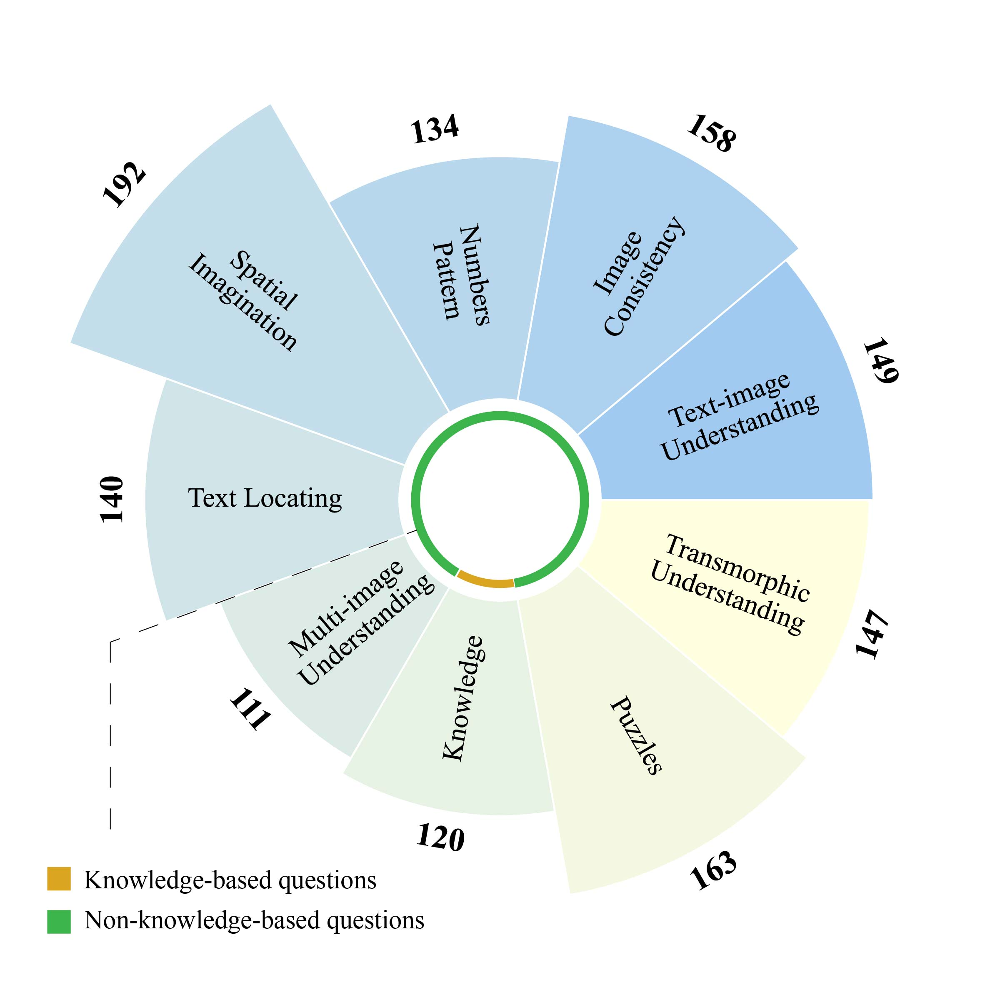
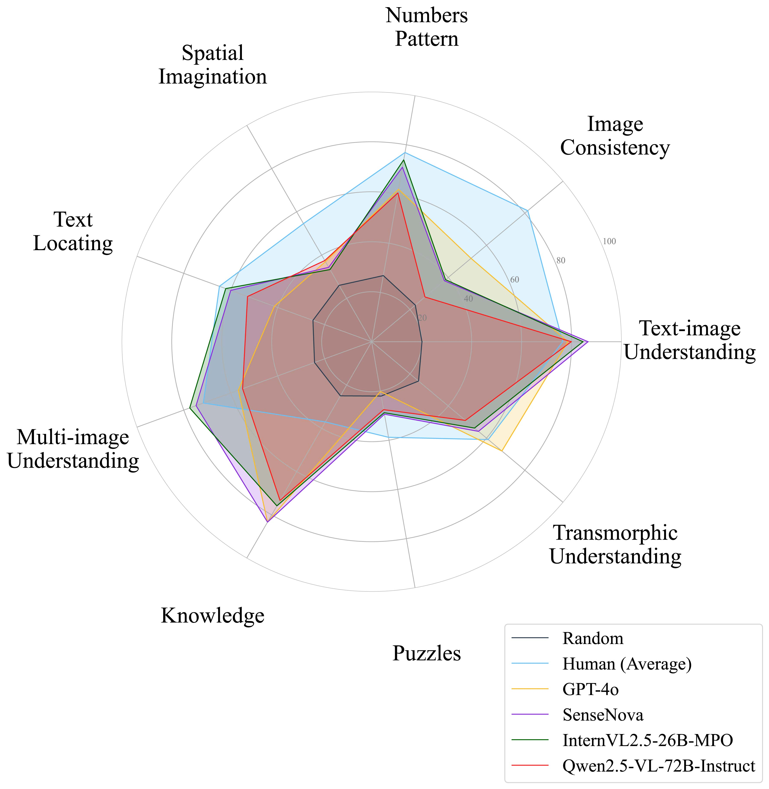

# MANBench

This repo contains evaluation code for the paper "MANBench: Is Your Multimodal Model Smarter than Human?"

[**🌐 Homepage**](/) | [**🤗 Dataset**](https://huggingface.co/datasets/MANBench/MANBench)

## 🔔News
* 🔥[2025-04-29]: We added the scores and outputs for GPT-1o and InternVL2.5-78B-MPO
* 🔥[2025-02-09]: MANBench is now available on [**🤗 Hugging Face**](https://huggingface.co/datasets/MANBench/MANBench)


## Introduction

We introduce **MANBench** (Multimodal Ability Norms Benchmark), a comprehensive benchmark designed to evaluate the multimodal capabilities of both humans and MLLMs. MANBench consists of 9
tasks, each containing more than 110 questions, with a total of 1,314 questions and 2,231 images. MANBench aims to provide a fair and rigorous assessment framework, ensuring that comparisons between human and machine performance are conducted on an equitable basis.

We conducted a large-scale human evaluation using the MANBench dataset, systematically comparing the performance of humans and MLLMs across a range of multimodal tasks. We evaluated 11 MLLMs, including state-of-art GPT-4o, Qwen2.5-VL-72B-Instruct, and Gemini-1.5 Pro on MANBench. We recruited 575 participants from diverse backgrounds to complete the tasks. Our results reveal that while MLLMs excel in tasks like Knowledge and Text-Image Understanding, they struggle in tasks requiring deeper cross-modal reasoning, such as Transmorphic Understanding, Image Consistency, and Multi-image Understanding. Notably, both humans and MLLMs face challenges in highly complex tasks like Puzzles and Spatial Imagination.

## Dataset Creat

<div align=center>

</div>


## Load Dataset

```python
import datasets

dataset_name = 'MANBench/MANBench'
dataset = load_dataset(dataset_name, split='train')
```

## Evaluation

1. Set up the environment variables.
```sh
export OPENAI_API_KEY=YOUR_OPENAI_API_KEY
export OPENAI_BASE_URL=https://api.openai.com/v1
```
2. Run the following command to evaluate the model on the MANBench dataset.
```sh
python eval/test_benchmark.py
```

*If ImportError occurs while executing this case, please install the required dependency packages as prompted.*

Feel free to add more models to `eval/query_model.py` and evaluate them on the MANBench dataset.

<div align=center>


</div>

## 🏆 Mini-Leaderboard

| Model | Overall | Text-image Understanding | Knowledge | Numbers Pattern | Multi-image Understanding | Transmorphic Understanding | Text Locating | Image Consistency | Spatial Imagination | Puzzles |
| --- | --- | --- | --- | --- | --- | --- | --- | --- | --- | --- |
| Human (Best) | 90.87 | 89.00 | 74.75 | 91.79 | 92.86 | 90.54 | 94.39 | 100.00 | 94.57 | 86.42 |
|🏅 Human (Average)| 62.26 | 76.46 | 37.05 | 76.88 | 71.69 | 60.90 | 64.82 | 81.55 | 54.56 | 38.83 |
|🥈 GPT-o1-2024-12-17| 59.97 | **88.59** | **85.83** | **73.88** | 64.86 | 68.03 | 54.29 | **53.16** | 34.90 | 33.74 |
|🥉 InternVL2.5-78B-MPO| 59.82 | 84.56 | 80.00 | 70.90 | 75.68 | 60.54 | **62.86** | 45.57 | 38.02 | **38.65** |
| SenseNova | 56.85 | 86.58 | 83.33 | 70.90 | 74.77 | 55.78 | 60.00 | 37.97 | 34.38 | 29.45 |
| InternVL2.5-26B-MPO | 56.32 | 84.56 | 75.83 | **73.88** | **77.48** | 53.74 | 62.14 | 38.61 | 33.33 | 28.83 |
| Gemini-1.5-Pro | 55.10 | 86.58 | 83.33 | 66.42 | 69.37 | 57.82 | 39.29 | 33.54 | **41.67** | 34.36 |
| Claude-3.5-Sonnet | 54.87 | 81.88 | 78.33 | 57.46 | 69.37 | 62.59 | 50.00 | 46.20 | 36.98 | 27.61 |
| Step-1o | 54.79 | 83.89 | 78.33 | 68.66 | 60.36 | **70.07** | 44.29 | 39.87 | 30.73 | 33.74 |
| GPT-4o | 53.81 | 78.52 | 83.33 | 61.94 | 56.76 | 68.03 | 41.43 | 51.90 | 36.98 | 20.25 |
| QVQ-72B-Preview | 50.00 | 76.51 | 82.50 | 58.21 | 63.96 | 46.94 | 42.86 | 31.01 | 31.77 | 34.36 |
| Qwen2.5-VL-72B-Instruct | 49.92 | 79.87 | 73.33 | 60.45 | 54.95 | 48.98 | 52.86 | 27.85 | 37.50 | 27.61 |
| Qwen2-VL-72B-Instruct | 46.19 | 77.85 | 79.17 | 58.96 | 48.65 | 43.54 | 38.57 | 28.48 | 32.29 | 23.31 |
| Deepseek-VL2 | 45.43 | 76.51 | 70.83 | 57.46 | 36.04 | 44.90 | 44.29 | 31.01 | 31.77 | 26.38 |
| InternVL2-26B | 41.86 | 61.74 | 67.50 | 54.48 | 43.24 | 46.26 | 33.57 | 24.68 | 29.69 | 27.61 |
| InternVL2-8B | 36.15 | 59.06 | 50.83 | 36.57 | 31.53 | 38.78 | 31.43 | 27.22 | 27.08 | 28.22 |
| Random | 24.05 | 20.13 | 25.00 | 26.87 | 24.32 | 24.49 | 25.00 | 22.78 | 26.04 | 22.09 |

🎯 **We have released a full suite comprising 1,314 [samples](https://huggingface.co/datasets/MANBench/MANBench), the [prompt](https://huggingface.co/datasets/MANBench/MANBench) we used, and [model predictions](eval/saved_outputs) for the baselines tested in our paper.**

## Disclaimers

**Low population coverage:** The experimental subjects in our study were primarily focused on a specific group within the Chinese linguistic context, which may introduce limitations in cross-linguistic adaptability. Specifically, cultural disparities, variations in knowledge reserves, and differences in cognitive patterns could significantly influence the applicability of our findings. Furthermore, the educational backgrounds and age distributions of our participants do not fully represent the broader human population, potentially limiting the generalizability of the human benchmarks established in this study.

**Image Attribution and Copyright Compliance:** The images utilized in our dataset were obtained from publicly available online sources. We have diligently ensured that all images included in this paper comply with applicable copyright laws and are accompanied by proper attribution. However, if you are the copyright holder of any image featured in our work and believe its usage violates your licensing terms, please [contact](#contact) us immediately. We are committed to resolving any legitimate copyright concerns in a timely and respectful manner.

## Contact

*During the ACL2025 review process, due to the double-blind policy, we are unable to provide our contact information.*